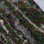
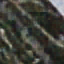
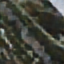
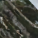
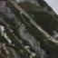

# Clear Vision: Image Restoration using Deep Learning

## Overview

Clear Vision is a deep learning-based image restoration system designed to remove noise from corrupted images. The project compares multiple neural network architectures and provides an interactive **Streamlit web interface** for visualizing the restoration results.

The system introduces **Gaussian noise** to an input image and then uses trained deep learning models to reconstruct the clean image.

The models evaluated in this project include:

- Basic Denoising Autoencoder
- Deep Denoising Autoencoder
- U-Net Restoration Network
- Residual Denoising CNN (DnCNN)

---

## Project Workflow

The overall workflow of the project is:

1. **Dataset Selection**
   - Used the **DIV2K dataset**, a high-quality dataset widely used for image restoration and super-resolution tasks.

2. **Patch Generation**
   - Images from the DIV2K dataset were divided into **64×64 patches**.
   - Patch-based training improves model learning efficiency and helps capture localized image features.

3. **Data Corruption**
   - Gaussian noise was artificially added to clean image patches to simulate degraded images.

4. **Model Training**
   - Four different deep learning architectures were trained to restore the clean images from the corrupted inputs.

5. **Model Evaluation**
   - Models were evaluated using standard image restoration metrics:
     - **PSNR (Peak Signal-to-Noise Ratio)**
     - **SSIM (Structural Similarity Index)**

6. **Deployment**
   - A **Streamlit web application** was developed to allow users to upload images and visualize restoration results from all models.

---

## Dataset

**DIV2K Dataset**

The DIV2K dataset contains high-resolution images commonly used in image restoration research.

Dataset characteristics:

- High-resolution images
- Diverse textures and scenes
- Widely used for image enhancement tasks

Before training, images were converted into **64×64 patches**.

---

## Model Architectures

### Basic Denoising Autoencoder
A simple encoder-decoder architecture that learns compressed image representations and reconstructs clean images from noisy inputs.

### Deep Denoising Autoencoder
An improved version of the autoencoder with deeper convolutional layers for better feature extraction.

### U-Net Restoration Network
A convolutional neural network with **skip connections**, enabling better preservation of spatial information during reconstruction.

### Residual Denoising CNN (DnCNN)
A deep residual network designed specifically for image denoising that learns to predict noise instead of the clean image.

---

## Example Restoration Result

| Original Image | Corrupted Image | Basic Autoencoder | Deep Autoencoder | U-Net | DnCNN |
|---------------|---------------|---------------|---------------|---------------|---------------|
|  |  |  |  |  |  |


---

## Quantitative Evaluation

| Model | PSNR (dB) | SSIM |
|------|------|------|
| Basic Denoising Autoencoder | 27.10 | 0.755 |
| Deep Denoising Autoencoder | 28.50 | 0.816 |
| U-Net Restoration Network | 31.26 | 0.903 |
| Residual Denoising CNN (DnCNN) | 31.37 | 0.892 |

---

## Patch-Based Image Restoration

The trained models operate on **64×64 image patches**, since the training dataset consisted of patches extracted from the DIV2K images.

To allow the application to process **larger user-uploaded images**, the Streamlit app uses a patch-based restoration pipeline implemented in `patch_utils.py`.

The process works as follows:

1. The uploaded image is converted into a tensor.
2. The image is **split into 64×64 patches**.
3. Each patch is passed through the restoration model.
4. The restored patches are **reconstructed into the final full image**.


## Streamlit Application

The project includes a **Streamlit-based web application** that allows users to:

- Upload an image
- Automatically add Gaussian noise
- Compare restoration results from multiple deep learning models
- View PSNR values for each model


**Application Workflow**

- Upload Image  
↓  
- Add Gaussian Noise  
↓  
- Run Restoration Models  
↓  
- Display Comparison Results

## Project Structure

```text
clear_vision/
│
├── app/
│   └── streamlit_app.py
│
├── models/
│   ├── simple_autoencoder_model.pth
│   ├── improved_autoencoder_model.pth
│   ├── unet_model.pth
│   └── dncnn_model.pth
│
├── utils/
│   ├── patch_utils.py
│   └── corruption_utils.py
│
├── notebooks/
│   └── clearvision.ipynb
│
├── models.py
├── requirements.txt
└── README.md

```
---

## Installation

Clone the repository:

```bash
git clone https://github.com/gogoi-anuraj/clear_vision.git
cd clear_vision
```
Install dependencies:
```bash
pip install -r requirements.txt
```
## Running the Application

Start the Streamlit app:
```bash
streamlit run app/streamlit_app.py
```
Open the browser at:
```
http://localhost:8501
```
---
## Future Improvements
- Support for multiple corruption types
- Implementing diffusion-based restoration models
- Training on larger datasets
- Real-time high-resolution restoration

## Live Demo

[https://clearvision.streamlit.app](https://clearvision-project.streamlit.app/)
